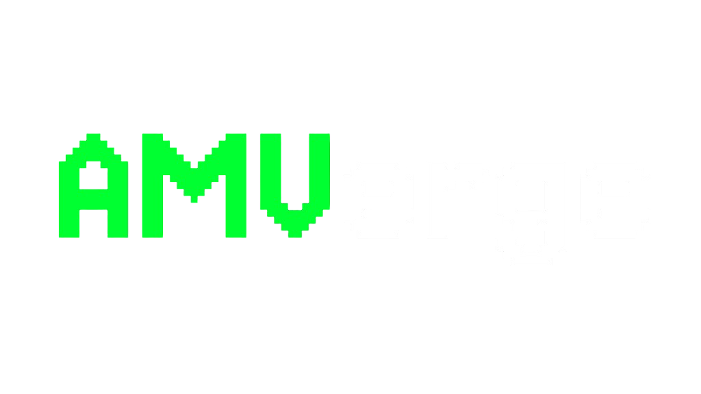

<p align="center">
  
</p>

<p align="center">
  
  
  
  
</p>

# AMVerge Website

Marketing landing page and documentation site for [AMVerge](https://github.com/AMVerge-team/AMVerge), the desktop scene selection tool for AMV editors.

Built with React 19, TypeScript, Vite 8, and MDX.

---

## Features

- **Landing page** — Hero with background video, feature sections, contributors grid
- **Features page** — Alternating left-right layout with video placeholders
- **Changelog** — Live GitHub releases with dedicated release pages and download links
- **FAQ** — Two-column accordion with animated expand
- **Docs** — MDX-powered documentation matching the landing aesthetic
- **Dynamic accent** — Hue slider rewrites `--accent` CSS variable globally
- **Download counter** — Cumulative counts from GitHub release assets

---

## Quick Start

```bash
git clone https://github.com/AMVerge-team/AMVerge-Website.git
cd AMVerge-Website
npm install
npm run dev        # http://localhost:5173
```

---

## Build

```bash
npm run build      # tsc + vite build -> dist/
npm run preview    # serve built dist/
npm run lint       # eslint
```

---

## Tech Stack

| Layer | Tech |
|---|---|
| Build | Vite 8 |
| UI | React 19 |
| Language | TypeScript ~6 |
| Routing | react-router-dom |
| Docs | MDX via `@mdx-js/rollup` |
| Fonts | Jersey 10 (Google Fonts) |
| Lint | eslint 9 + typescript-eslint |

No backend. Download counts read live from the GitHub releases API.

---

## Project Structure

```
src/
├── components/
│   ├── home/          Landing, About, Explanation, Merge, CTA, Contributors
│   ├── ui/            Navbar, Footer, MiniUI, SectionDivider, ContributorAvatars
│   └── features/      DetectSection, BrowseSection, MergeFeatureSection, ExportSection
├── pages/             Features, Changelog, FAQ, Gallery, ChangelogRelease
├── css/               home.css, pages.css, features.css, docs.css
├── docs/              DocsLayout, registry, MDX pages
├── services/github/   GitHub API client, releases, contributors
└── hooks/             useFadeIn, useContributors
```

---

## AI Agents

An [AGENTS.md](AGENTS.md) file is included for AI coding assistants.

---

## License

AMVerge Website is licensed under the GNU GPL v3.0. See [LICENSE](LICENSE) for details.

Based on AMVerge by [Crptk](https://github.com/crptk).

---

## Contributing

See [CONTRIBUTING.md](CONTRIBUTING.md) for guidelines on reporting issues, submitting PRs, and development setup.
